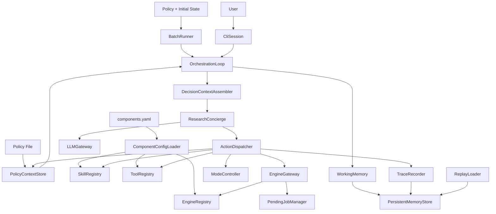
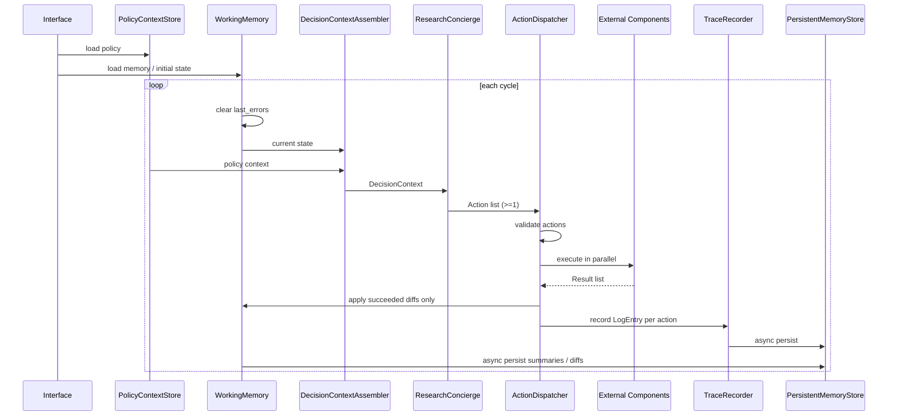
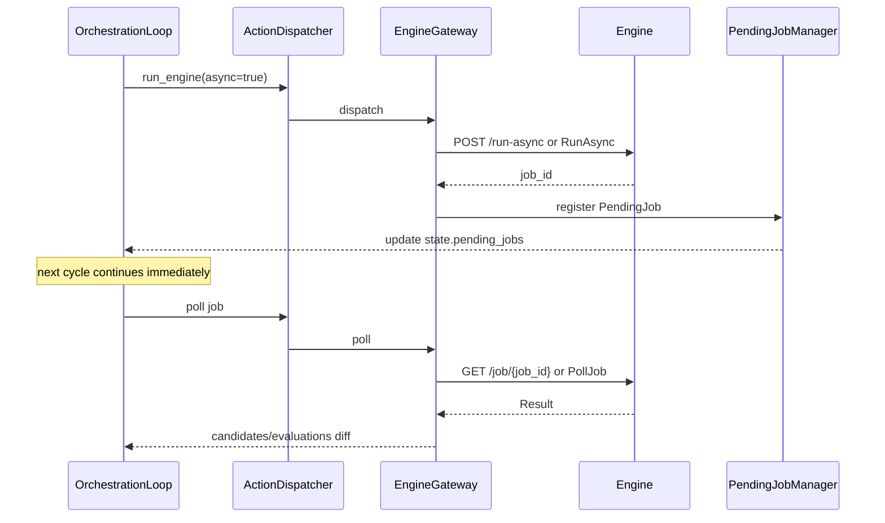

# 設計書

## 概要

EqOrch は、方程式探索アルゴリズム自体ではなく、探索ワークフローを制御するオーケストレーション層である。本設計は `[requirements.md](/Users/Daily/Development/EqOrch/.kiro/specs/eqorch/requirements.md)` を実装可能な構造へ落とし込み、ポリシー、状態、命令、外部実行系、永続化、トレースの責務境界を固定する。

設計方針は次の 4 点である。

- LLM は制御判断のみを担い、数値評価や大規模候補処理は外部コンポーネントへ委任する
- すべての外部境界は契約先行で定義し、レジストリ / ゲートウェイ経由で接続する
- ワークフローメモリはオンメモリ層と永続層に分離し、再現性と低レイテンシを両立する
- すべての命令実行を `LogEntry` と状態差分で追跡し、任意ステップ再現を可能にする

## 要求トレーサビリティ

| Requirement | 設計要素 | 備考 |
|-------------|----------|------|
| 1 | `PolicyContextStore`, `PolicyContext`, `ModeRuleEvaluator` | ポリシー読込、既定値、構文検証 |
| 2 | `DecisionContextAssembler`, `ResearchConcierge` | 状態解釈と命令決定 |
| 3 | `State`, `Candidate`, `Evaluation`, `Action`, `Result`, `ErrorInfo`, `Memory`, `PendingJob`, `LogEntry` | コアデータモデル |
| 4 | `SkillRegistry`, `SkillAdapter` | `State -> Result` |
| 5 | `ToolRegistry`, `ToolAdapter` | `Request -> Result` |
| 6 | `EngineRegistry`, `EngineGateway`, `BackendGateway` | REST / gRPC、非同期ジョブ |
| 7 | `ModeController`, `ModeRuleEvaluator` | `interactive` / `batch` |
| 8 | `WorkingMemory`, `PersistentMemoryStore`, `ReplayLoader` | 2 層メモリ、非同期永続化 |
| 9 | `TraceRecorder`, `CandidateValidator` | 推論根拠の保持 |
| 10 | `TraceRecorder`, `ReplayLoader` | 再現と突合 |
| 11 | `OrchestrationLoop`, `ActionDispatcher` | 命令リスト、部分適用、終了処理 |
| 12 | `CliSession`, `BatchRunner`, `ComponentConfigLoader` | CLI / バッチ / YAML 設定 |
| 13 | `PerformanceBudget`, `LayerBoundaryRules` | 非機能と設計制約 |
| 14 | `RuntimeEnvironmentChecks` | 前提条件 |
| 15 | `ErrorCoordinator`, `RetryPolicyExecutor` | エラー処理と遷移 |
| 16 | `PendingJobManager`, `ResultNormalizer` | `partial`、ジョブ追跡 |

## アーキテクチャ

### 境界

- `Policy`: 外部ポリシーファイル、既定値補完、ルール評価
- `Decision`: `State + Policy + Memory` を入力に命令を決定
- `LLM Gateway`: OpenAI 互換 / Anthropic 互換 API を抽象化
- `Execution`: スキル、ツール、エンジン、バックエンド呼び出し
- `Memory`: オンメモリ状態、永続化、再ロード
- `Trace`: `LogEntry` と状態差分、再現支援
- `Interface`: CLI、バッチ起動、コンポーネント設定



### 採用パターン

- 状態駆動オーケストレーション
- 契約先行アダプタ
- 非同期永続化
- イミュータブルな実行記録 + 差分適用

## 主要フロー

### オーケストレーションループ



設計上の決定:

- 各サイクルの先頭で `State.last_errors` をクリアする
- コンシェルジュは空リストを返さず、1 件以上の `Action` を返す
- `ask_user` と `terminate` は単独実行のみ許容する
- 成功した命令だけを差分適用し、失敗分は `last_errors` に記録する

### 非同期エンジン実行



### 終了時の完了待ちジョブ処理

- `terminate` 発行時に `pending_jobs` が残っていれば、各エンジンへキャンセル要求を送信する
- キャンセル応答待ちは行わず、送信成否だけを `LogEntry` へ記録する
- 最終コミット後にループを終了する

## コンポーネント設計

### `PolicyContextStore`

責務:

- Markdown / YAML / TOML の読込
- 既定値補完
- `goals` 非空、必須項目、値域の検証
- `update_policy` の次サイクル反映

入出力:

- Input: policy file / patch
- Output: 正規化済み `PolicyContext`

不変条件:

- `goals` は 1 件以上
- `exploration_strategy` は `expand|refine|restart`
- `retry.excluded_types` 既定値は `ask_user|switch_mode|terminate`

### `ModeRuleEvaluator`

責務:

- `mode_switch_criteria.rules` の条件評価
- `notes` は参考情報として `ResearchConcierge` へ渡す

契約:

```ts
interface ModeRule {
  condition: string
  target_mode: "interactive" | "batch"
  reason: string
}
```

- `condition` は EqOrch 本体組込みの式評価器で評価する
- 遷移起動条件は `rules` のみで決まり、`notes` は非決定情報

### `ResearchConcierge`

責務:

- `DecisionContext` から命令リストを生成
- 停滞、冗長性、探索偏りを解釈
- モード遷移判断
- 必要に応じて批評・評価の補助モジュールを呼び出す

契約:

```ts
interface ResearchConciergeService {
  decide(context: DecisionContext): Action[]
}
```

- 必ず 1 件以上の `Action` を返す
- 実行は行わず、判断のみ行う
- `DecisionContextAssembler` から渡された `State.last_errors` を次サイクル判断入力として解釈する

拡張点:

- `CritiqueAgentAdapter`
- `EvaluationAgentAdapter`

これらは任意導入とし、導入時は `DecisionContext` を入力に補助判断を返す。

### `LLMGateway`

責務:

- OpenAI 互換 API と Anthropic 互換 API の差異を吸収する
- `DecisionContext` を LLM 入力へ変換する
- プロバイダ固有レスポンスを `Action[]` へ正規化する

契約:

```ts
interface LLMGatewayService {
  decide(context: DecisionContext): Action[]
}
```

設計規則:

- `ResearchConcierge` は直接プロバイダ SDK を呼ばない
- プロバイダ差異は `LLMGateway` 配下のアダプタで隔離する
- コンテキスト超過時は `llm_context_steps` に基づく要約入力を用いる

### `ActionDispatcher`

責務:

- `Action.type` に応じた実行先解決
- `Action.parameters` 検証
- `Result` 標準化
- 成功分だけの差分適用計画生成

契約:

```ts
interface ActionDispatcherService {
  dispatch(actions: Action[], state: State): DispatchBatchResult
}
```

検証規則:

- `call_skill.input` 必須
- `call_tool.query` 必須
- `run_engine.instruction` 必須
- `ask_user.prompt` 必須
- `update_policy.patch` 必須
- `switch_mode.target_mode` 必須
- 未定義フィールドは拒否
- 既定値:
  - `call_skill.timeout_sec=60`
  - `call_tool.timeout_sec=30`
  - `run_engine.timeout_sec=3600`
  - `run_engine.async=false`
- 任意フィールド:
  - `ask_user.options`
  - `switch_mode.reason`
  - `terminate.reason`

### `SkillRegistry` / `ToolRegistry`

契約:

```ts
interface SkillContract {
  execute(state: State): Result
}

interface ToolContract {
  execute(request: Request): Result
}
```

- 未登録時は `SKILL_NOT_FOUND` / `TOOL_NOT_FOUND`
- タイムアウト時は `Result.status=timeout`

### `EngineRegistry` / `EngineGateway`

責務:

- `components.yaml` の `engines` を解決
- REST / gRPC 通信
- 同期 / 非同期実行
- `PendingJob` 管理連携

REST 契約:

- 同期: `POST {endpoint}/run`
- 非同期: `POST {endpoint}/run-async`
- 完了確認: `GET {endpoint}/job/{job_id}`

gRPC 契約:

- `EngineService.Run`
- `EngineService.RunAsync`
- `EngineService.PollJob`

設定契約:

```yaml
skills:
  - name: physics_constraint_checker
    module: eqorch.skills.physics
    class: PhysicsConstraintChecker

tools:
  - name: arxiv_search
    module: eqorch.tools.arxiv
    class: ArxivSearchTool
```

```yaml
engines:
  - name: symbolic_regression
    endpoint: http://localhost:8080/engine
    protocol: rest
```

または

```yaml
engines:
  - name: symbolic_regression
    endpoint: dns:///engine
    protocol: grpc
    proto: path/to/engine.proto
    service: EngineService
```

### `BackendGateway`

責務:

- 数値実行バックエンドへの委任
- 実行コマンドと設定辞書の転送
- 数値結果とステータスの正規化

契約:

```ts
interface BackendGatewayService {
  run(command: ExecutionCommand, config: Record<string, unknown>): BackendExecutionResult
}
```

```ts
type ExecutionCommand = {
  executable: string
  args: string[]
}

type BackendExecutionResult = {
  status: "success" | "error" | "timeout" | "partial"
  numeric_results: Record<string, number>
  error: ErrorInfo | null
}
```

失敗条件:

- タイムアウト時は `status=timeout`
- 実行失敗時は `status=error`
- 一部の数値結果のみ取得できた場合は `status=partial`

### `WorkingMemory`

責務:

- 現在サイクル状態の低レイテンシ参照
- `Policy.max_candidates` / `max_evaluations` による保持上限
- `lru` / `fifo` 退避

既定:

- `eviction_policy=lru`

### `PersistentMemoryStore`

責務:

- `SQLite` を既定実装として永続化
- `JSON Lines` への書出し互換
- `LogEntry`、中間サマリー、ポリシー改訂、モード遷移履歴の保存
- 起動時 / 再起動時のロード

設計判断:

- 既定ストアは `SQLite`
- `TraceLog` は `JSON Lines` 形式でも出力可能にする
- 永続化は非同期実行し、上限超過時は次サイクルで再試行する

### `RuntimeEnvironmentChecks`

責務:

- 起動前に LLM API 接続可能性を確認する
- 外部探索エンジン / 実行バックエンド設定が契約を満たすことを検証する
- ポリシーファイルが有効形式で存在することを検証する

実行タイミング:

- `CliSession` / `BatchRunner` から `OrchestrationLoop` 起動前に実行する

失敗時挙動:

- 前提条件を満たさない場合はループを開始せず、原因を返して終了する

### `TraceRecorder`

責務:

- 命令ごとの `LogEntry` 生成
- `state_diff` を RFC 6902 JSON Patch として生成
- `path` を RFC 6901 JSON Pointer で表現
- 状態更新ごとの `input_summary` / `output_summary` 生成

再現ポリシー:

- 再現対象は決定的状態のみ
- `reasoning` などの LLM 生成テキストは一致判定の必須対象外

## データモデル

### `PolicyContext`

```ts
type PolicyContext = {
  goals: string[]
  constraints: string[]
  forbidden_operations: string[]
  exploration_strategy: "expand" | "refine" | "restart"
  mode_switch_criteria: {
    rules: ModeRule[]
    notes: string[]
  }
  max_candidates: number // default 100
  max_evaluations: number // default 500
  max_memory_entries: number // default 1000
  max_parallel_actions: number // default 8
  llm_context_steps: number // default 20
  triggers: {
    stagnation_threshold: number
    diversity_threshold: number
  }
  retry: {
    max_retries: number // default 3
    retry_interval_sec: number // default 5
    excluded_types: string[] // default ask_user,switch_mode,terminate
  }
}
```

### `State`

```ts
type State = {
  policy_context: PolicyContext
  workflow_memory: Memory
  candidates: Candidate[]
  evaluations: Evaluation[]
  current_mode: "interactive" | "batch"
  session_id: UUIDv4
  step: number
  pending_jobs: PendingJob[]
  last_errors: Record<string, ErrorInfo>
}
```

### `Candidate` / `Evaluation`

```ts
type Candidate = {
  id: UUIDv4
  equation: string
  score: number
  reasoning: string
  origin: "LLM" | "Engine" | "Hybrid"
  created_at: ISO8601UTC
  step: number
}

type Evaluation = {
  id: UUIDv4
  candidate_id: UUIDv4
  metrics: {
    mse: number
    complexity: number
    extra: Record<string, number>
  }
  evaluator: string
  timestamp: ISO8601UTC
}
```

`Candidate.score` の意味論:

- `origin=Engine`: エンジン算出済みの正規化スコア
- `origin=LLM`: エンジン評価前の暫定値
- `origin=Hybrid`: LLM 提案後にエンジンが付与したスコア

### `Action` / `Result`

```ts
type Action = {
  type: "call_skill" | "call_tool" | "run_engine" | "ask_user" | "update_policy" | "switch_mode" | "terminate"
  target: string
  parameters: Record<string, unknown>
  issued_at: ISO8601UTC
  action_id: UUIDv4
}

type Result = {
  status: "success" | "error" | "timeout" | "partial"
  payload: Record<string, unknown>
  error: ErrorInfo | null
}
```

`status=partial` の設計規則:

- `payload` には取得済みの有効データを保持する
- `error` には部分失敗理由を保持する
- 状態更新時は成功データのみ差分適用し、未取得分は適用しない

### `Memory` / `LogEntry` / `PendingJob`

```ts
type Memory = {
  entries: MemoryEntry[]
  max_entries: number
  eviction_policy: "lru" | "fifo"
}

type MemoryEntry = {
  key: string
  value: Record<string, unknown>
  created_at: ISO8601UTC
  last_accessed: ISO8601UTC
}

type LogEntry = {
  step: number
  session_id: UUIDv4
  action_id: UUIDv4
  action: Action
  result: Result
  input_summary: string
  output_summary: string
  state_diff: StateDiffEntry[]
  duration_ms: number
  timestamp: ISO8601UTC
}

type StateDiffEntry = {
  op: "add" | "remove" | "replace"
  path: JSONPointer
  value?: unknown
}

type PendingJob = {
  job_id: string
  engine_name: string
  action_id: UUIDv4
  issued_at: ISO8601UTC
  timeout_at: ISO8601UTC
}
```

## エラーハンドリング

- 単一コンポーネント失敗ではループ全体を停止しない
- すべての失敗は `ErrorInfo` に正規化する
- LLM タイムアウト / HTTP 5xx は `retry` に従って再試行する
- LLM 再試行上限超過:
  - `interactive`: `ask_user` 相当へ遷移
  - `batch`: 終了処理へ遷移
- 永続化失敗:
  - 次サイクルで再試行
  - 上限超過で通知し停止許容
- 部分的状態変更失敗:
  - ロールバックして直前整合状態を維持

## 非機能設計

- オンメモリ状態参照: `p99 <= 10ms`
- LLM 判断時間を除く制御オーバーヘッド: `p99 <= 50ms / cycle`
- 永続化によるループブロック: `<= 1ms`
- 1000 候補以上、方程式長 256 以下、評価メトリクス数 3 以下で CPU 使用率 80% 以下を目標
- 1 サイクル最大並行命令数は既定 `8`

これを満たすための設計規則:

- 永続化は非同期キューへ積み、ループ本体から切り離す
- 状態更新は差分適用ベースでコピー量を抑える
- 外部実行系との通信はアダプタ境界で閉じる

## テスト戦略

### 単体テスト

- `PolicyContextStore` の既定値補完と `goals` 非空検証
- `ModeRuleEvaluator` の条件式評価
- `ActionDispatcher` のパラメータ検証
- `TraceRecorder` の JSON Patch / JSON Pointer 生成
- `WorkingMemory` の `lru` / `fifo` 退避

### 結合テスト

- `components.yaml` からの Registry 初期化
- REST / gRPC エンジンスタブ接続
- `run-async` / `PollJob` による非同期エンジン実行
- `SQLite` 永続化と再起動復元

### E2E テスト

- 対話モード探索
- バッチ探索
- LLM リトライ上限超過時のモード別遷移
- 完了待ちジョブを残したままの終了
- クラッシュ後の最終コミット状態からの再開
