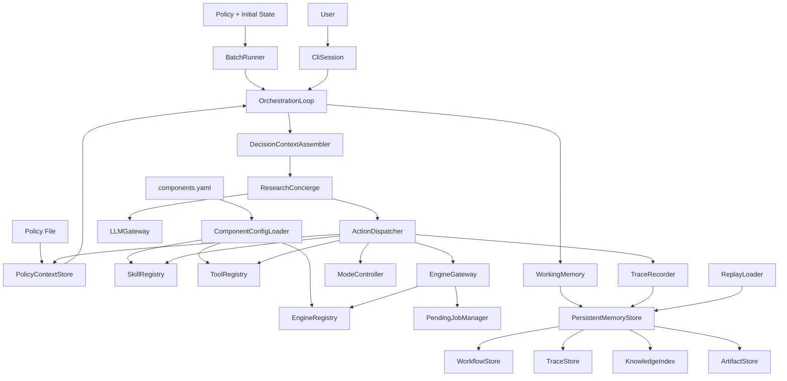
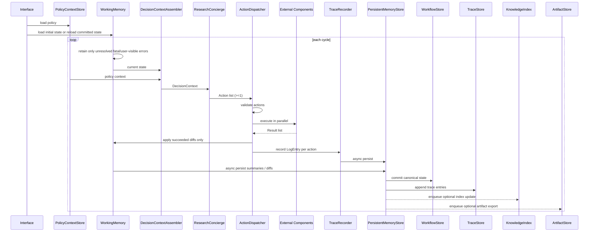
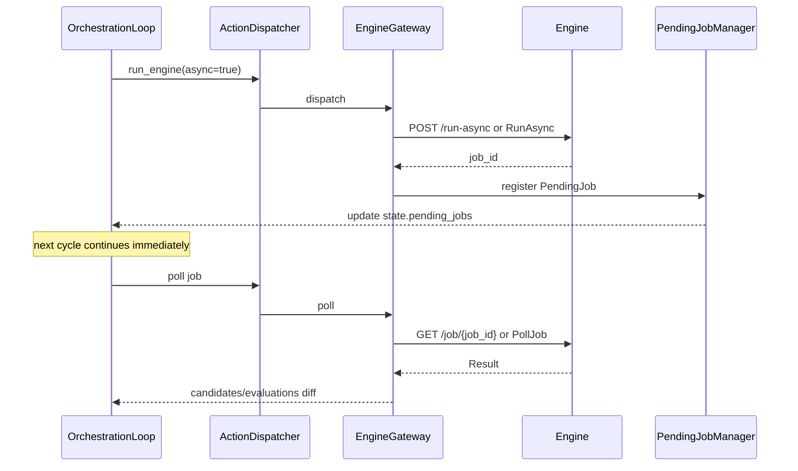

# 設計書

## 概要

EqOrch は、方程式探索アルゴリズム自体ではなく、探索ワークフローを制御するオーケストレーション層である。本設計は `[requirements.md](/Users/Daily/Development/EqOrch/.kiro/specs/eqorch/requirements.md)` を実装可能な構造へ落とし込み、ポリシー、状態、命令、外部実行系、永続化、トレースの責務境界を固定する。

設計方針は次の 4 点である。

- LLM は制御判断のみを担い、数値評価や大規模候補処理は外部コンポーネントへ委任する
- すべての外部境界は契約先行で定義し、レジストリ / ゲートウェイ経由で接続する
- ワークフローメモリはオンメモリ層と永続層に分離し、再現性と低レイテンシを両立する
- すべての命令実行を `LogEntry` と状態差分で追跡し、任意ステップ再現を可能にする

## 要求トレーサビリティ

| Requirement | 設計要素 | 備考 |
|-------------|----------|------|
| 1 | `PolicyContextStore`, `PolicyContext`, `ModeRuleEvaluator` | ポリシー読込、既定値、構文検証 |
| 2 | `DecisionContextAssembler`, `ResearchConcierge` | 状態解釈と命令決定 |
| 3 | `State`, `Candidate`, `Evaluation`, `Action`, `Result`, `ErrorInfo`, `Memory`, `PendingJob`, `LogEntry` | コアデータモデル |
| 4 | `SkillRegistry`, `SkillAdapter` | `SkillRequest -> Result` |
| 5 | `ToolRegistry`, `ToolAdapter` | `Request -> Result` |
| 6 | `EngineRegistry`, `EngineGateway`, `BackendGateway` | REST / gRPC、非同期ジョブ |
| 7 | `ModeController`, `ModeRuleEvaluator` | `interactive` / `batch` |
| 8 | `WorkingMemory`, `PersistentMemoryStore`, `WorkflowStore`, `TraceStore`, `ReplayLoader`, `KnowledgeIndex`, `ArtifactStore` | 2 層メモリ、正本永続化、補助ストア |
| 9 | `TraceRecorder`, `CandidateValidator` | 推論根拠の保持 |
| 10 | `TraceRecorder`, `ReplayLoader` | 再現と突合 |
| 11 | `OrchestrationLoop`, `ActionDispatcher` | 命令リスト、部分適用、終了処理 |
| 12 | `CliSession`, `BatchRunner`, `ComponentConfigLoader` | CLI / バッチ / YAML 設定 |
| 13 | `PerformanceBudget`, `LayerBoundaryRules` | 非機能と設計制約 |
| 14 | `RuntimeEnvironmentChecks` | 前提条件 |
| 15 | `ErrorCoordinator`, `RetryPolicyExecutor` | エラー処理と遷移 |
| 16 | `PendingJobManager`, `ResultNormalizer` | `partial`、ジョブ追跡 |

## アーキテクチャ

### 境界

- `Policy`: 外部ポリシーファイル、既定値補完、ルール評価
- `Decision`: `State + Policy + Memory` を入力に命令を決定
- `LLM Gateway`: OpenAI / Anthropic / Google Gemini を含む複数 provider API を抽象化
- `Execution`: スキル、ツール、エンジン、バックエンド呼び出し
- `Memory`: オンメモリ状態、永続化、再ロード
- `Trace`: `LogEntry` と状態差分、再現支援
- `Interface`: CLI、バッチ起動、コンポーネント設定

用語規約:

- `workflow_memory` は `State` が保持するオンメモリのワークフローデータを指す
- `Memory` は `workflow_memory` のデータ型を指す
- `WorkingMemory` は `workflow_memory` の更新、退避、再読込を管理するコンポーネントを指す
- `PersistentMemoryStore` は永続化オーケストレーションを担う facade を指す
- `WorkflowStore` は PostgreSQL 正本へ `State`、`Candidate`、`Evaluation`、`Policy` 改訂履歴、モード遷移履歴を保存する構造化保存層を指す
- `TraceStore` は PostgreSQL 正本内で `LogEntry` と replay 用差分列を保存する論理分離層を指す
- `KnowledgeIndex` は optional な Vector DB 補助インデックスを指す
- `ArtifactStore` は optional な Object Storage 補助ストアを指す



### 採用パターン

- 状態駆動オーケストレーション
- 契約先行アダプタ
- 非同期永続化
- イミュータブルな実行記録 + 差分適用

## 主要フロー

### オーケストレーションループ



設計上の決定:

- 各サイクルの先頭で `State.last_errors` 全体を消去せず、未消化の致命エラーまたは通知対象エラーだけを保持する
- コンシェルジュは空リストを返さず、1 件以上の `Action` を返す
- `ask_user` と `terminate` は単独実行のみ許容する
- 成功した命令だけを差分適用し、失敗分は `last_errors` に記録する
- 同一サイクルで複数成功結果の `state_diff` が同一 JSON Pointer を更新する場合は競合として扱い、競合した命令は適用せず `CONFLICTING_STATE_DIFF` を記録する

### 非同期エンジン実行



### 終了時の完了待ちジョブ処理

- `terminate` 発行時に `pending_jobs` が残っていれば、各エンジンへキャンセル要求を送信する
- キャンセル応答待ちは行わず、送信成否だけを `LogEntry` へ記録する
- 最終コミット後にループを終了する

## コンポーネント設計

### `PolicyContextStore`

責務:

- Markdown / YAML / TOML の読込
- 既定値補完
- `goals` 非空、必須項目、値域の検証
- `update_policy` の次サイクル反映

入出力:

- Input: policy file / patch
- Output: 正規化済み `PolicyContext`

不変条件:

- `goals` は 1 件以上
- `exploration_strategy` は `expand|refine|restart`
- `retry.excluded_types` 既定値は `ask_user|switch_mode|terminate`

### `ModeRuleEvaluator`

責務:

- `mode_switch_criteria.rules` の条件評価
- `notes` は参考情報として `ResearchConcierge` へ渡す

契約:

```ts
interface ModeRule {
  condition: string
  target_mode: "interactive" | "batch"
  reason: string
}
```

- `condition` は EqOrch 本体組込みの式評価器で評価する
- 遷移起動条件は `rules` のみで決まり、`notes` は非決定情報

### `ResearchConcierge`

責務:

- `DecisionContext` から命令リストを生成
- 停滞、冗長性、探索偏りを解釈
- モード遷移判断
- 必要に応じて批評・評価の補助モジュールを呼び出す

契約:

```ts
interface ResearchConciergeService {
  decide(context: DecisionContext): Action[]
}
```

- 必ず 1 件以上の `Action` を返す
- 実行は行わず、判断のみ行う
- `DecisionContextAssembler` から渡された `State.last_errors` を次サイクル判断入力として解釈する

拡張点:

- `CritiqueAgentAdapter`
- `EvaluationAgentAdapter`

これらは任意導入とし、導入時は `DecisionContext` を入力に補助判断を返す。

### `LLMGateway`

責務:

- OpenAI、Anthropic、Google Gemini provider の差異を吸収する
- `DecisionContext` を LLM 入力へ変換する
- プロバイダ固有レスポンスを `Action[]` へ正規化する

契約:

```ts
interface LLMGatewayService {
  decide(context: DecisionContext): Action[]
}
```

設計規則:

- `ResearchConcierge` は直接プロバイダ SDK を呼ばない
- プロバイダ差異は `LLMGateway` 配下のアダプタで隔離する
- `LLMGateway` は少なくとも `OpenAIAdapter`、`AnthropicAdapter`、`GoogleAdapter` を差し替え可能な provider adapter として保持する
- provider ごとの function calling、tool use、JSON mode の差異があっても、EqOrch 内部では共通 `Action[]` のみを扱う
- コンテキスト超過時は `llm_context_steps` に基づく要約入力を用いる

### `CandidateValidator`

責務:

- Candidate と Evaluation の参照整合性、値域、重複、受理条件を検証する
- 不正な候補や評価を状態反映前に拒否する
- 拒否理由を `TraceRecorder` と連携して追跡可能にする

呼び出し位置:

- `ActionDispatcher` が結果を状態差分へ変換する前
- `OrchestrationLoop` が候補や評価をコミットする前

### `ActionDispatcher`

責務:

- `Action.type` に応じた実行先解決
- `Action.parameters` 検証
- `Result` 標準化
- 成功分だけの差分適用計画生成

契約:

```ts
interface ActionDispatcherService {
  dispatch(actions: Action[], state: State): DispatchBatchResult
}
```

```ts
type DispatchBatchResult = {
  succeeded: Array<{
    action_id: UUIDv4
    result: Result
    state_diff: StateDiffEntry[]
  }>
  failed: Array<{
    action_id: UUIDv4
    error: ErrorInfo
  }>
}
```

検証規則:

- `call_skill.input` 必須
- `call_tool.query` 必須
- `run_engine.instruction` 必須
- `ask_user.prompt` 必須
- `update_policy.patch` 必須
- `switch_mode.target_mode` 必須
- 未定義フィールドは拒否
- 既定値:
  - `call_skill.timeout_sec=60`
  - `call_tool.timeout_sec=30`
  - `run_engine.timeout_sec=3600`
  - `run_engine.async=false`
- 任意フィールド:
  - `ask_user.options`
  - `switch_mode.reason`
  - `terminate.reason`

### `ErrorCoordinator`

責務:

- 外部実行、LLM 判断、永続化、状態適用で発生した失敗を `ErrorInfo` へ正規化する
- ループ継続可能な失敗と、通知または停止対象の失敗を分類する
- `last_errors` とユーザ通知対象の切り分けを行う
- `last_errors` に残す対象は未消化の致命エラーまたは通知対象エラーに限定する

呼び出し位置:

- `ActionDispatcher` の実行結果取りまとめ時
- `OrchestrationLoop` のサイクル終端処理時

### `RetryPolicyExecutor`

責務:

- ポリシーの `retry` 設定に従い再試行可否、回数、間隔、除外対象を評価する
- LLM 障害、永続化失敗、再試行上限超過時のモード別遷移を制御する
- `ErrorCoordinator` と連携し、再試行不能時の終了または問い合わせへ接続する

呼び出し位置:

- `ResearchConcierge` / `LLMGateway` の失敗処理
- 永続化失敗については `PersistentMemoryStore` 内の最小実装で再試行してよく、共通 executor の利用は必須としない

### `SkillRegistry` / `ToolRegistry`

契約:

```ts
type Request = {
  query: string
  context?: Record<string, unknown>
  timeout_sec?: number
}

type SkillRequest = {
  state: State
  input: Record<string, unknown>
  timeout_sec?: number
}

interface SkillContract {
  execute(request: SkillRequest): Result
}

interface ToolContract {
  execute(request: Request): Result
}
```

- `call_skill.input` は `SkillRequest.input` へ正規化する
- `SkillRequest.state` は実行時点の `State` を渡す
- `call_tool.query` は `Request.query` へ正規化する
- `context` は任意の補助入力を表す
- `context` は JSON 互換の値のみを受け入れ、非 JSON 値は `INVALID_REQUEST_CONTEXT` として拒否する
- `context` の既知予約キーは `session_id`、`step`、`candidate_id`、`evaluation_id` とし、未知キーはアダプタ境界で透過してよい
- `query` と `context` はアダプタ境界でサイズ上限を検証し、上限超過時は `REQUEST_TOO_LARGE` として拒否する
- 未登録時は `SKILL_NOT_FOUND` / `TOOL_NOT_FOUND`
- タイムアウト時は `Result.status=timeout`

### `EngineRegistry` / `EngineGateway`

責務:

- `components.yaml` の `engines` を解決
- REST / gRPC 通信
- 同期 / 非同期実行
- `PendingJob` 管理連携

REST 契約:

- 同期: `POST {endpoint}/run`
- 非同期: `POST {endpoint}/run-async`
- 完了確認: `GET {endpoint}/job/{job_id}`

gRPC 契約:

- `EngineService.Run`
- `EngineService.RunAsync`
- `EngineService.PollJob`

設定契約:

```yaml
skills:
  - name: physics_constraint_checker
    module: eqorch.skills.physics
    class: PhysicsConstraintChecker

tools:
  - name: arxiv_search
    module: eqorch.tools.arxiv
    class: ArxivSearchTool
```

```yaml
engines:
  - name: symbolic_regression
    endpoint: http://localhost:8080/engine
    protocol: rest
```

または

```yaml
engines:
  - name: symbolic_regression
    endpoint: dns:///engine
    protocol: grpc
    proto: path/to/engine.proto
    service: EngineService
```

### `BackendGateway`

責務:

- 数値実行バックエンドへの委任
- 実行コマンドと設定辞書の転送
- 数値結果とステータスの正規化

契約:

```ts
interface BackendGatewayService {
  run(command: ExecutionCommand, config: Record<string, unknown>): BackendExecutionResult
}
```

```ts
type ExecutionCommand = {
  executable: string
  args: string[]
}

type BackendExecutionResult = {
  status: "success" | "error" | "timeout" | "partial"
  numeric_results: Record<string, number>
  error: ErrorInfo | null
}
```

失敗条件:

- タイムアウト時は `status=timeout`
- 実行失敗時は `status=error`
- 一部の数値結果のみ取得できた場合は `status=partial`

受入制約:

- `ExecutionCommand.args`、設定辞書、数値結果はアダプタ境界でサイズ上限を検証する
- `numeric_results` は文字列キーと有限実数値のみを受け入れ、非数値、`NaN`、`Infinity` を含む場合は `INVALID_BACKEND_RESULT` として拒否する
- 想定外の補助フィールドは `ResultNormalizer` が破棄し、EqOrch 本体へは正規化済み `Result` のみを渡す

### `WorkingMemory`

責務:

- 現在サイクル状態の低レイテンシ参照
- `Policy.max_candidates` / `max_evaluations` による保持上限
- `lru` / `fifo` 退避

既定:

- `eviction_policy=lru`

### `PersistentMemoryStore`

責務:

- `WorkflowStore`、`TraceStore`、`KnowledgeIndex`、`ArtifactStore` への書込み順を調停する
- 正本保存と補助層反映の非同期境界を管理する
- 起動時 / 再起動時のロード入口として `WorkflowStore` と `TraceStore` を束ねる

契約:

```ts
type ArtifactReference = {
  uri: string
  kind: "raw_log" | "report" | "external_artifact"
}

type PersistenceCommit = {
  state_snapshot: State
  state_summaries: Record<string, unknown>
  trace_entries: LogEntry[]
  auxiliary_artifacts?: ArtifactReference[]
}

type PersistenceCommitResult = {
  committed: boolean
  workflow_version: string
  trace_version: string
  auxiliary_enqueued: boolean
}

interface PersistentMemoryStoreService {
  commit(batch: PersistenceCommit): PersistenceCommitResult
  load_latest(session_id: UUIDv4): State | null
  load_replay_base(session_id: UUIDv4, step?: number): State | null
}
```

設計判断:

- PostgreSQL を再現と再開の唯一の正本とし、`WorkflowStore` と `TraceStore` はその上に載る
- 書込み順は `WorkflowStore`、`TraceStore`、`KnowledgeIndex` / `ArtifactStore` の順とする
- `WorkflowStore` または `TraceStore` の失敗は正本失敗として扱う
- `KnowledgeIndex` と `ArtifactStore` の失敗は補助層失敗として扱い、正本コミット成功時は再試行対象に留める
- 永続化は非同期実行し、上限超過時は次サイクルで再試行する

### `WorkflowStore`

責務:

- PostgreSQL 正本へ `State`、`Candidate`、`Evaluation`、`Policy` 改訂履歴、モード遷移履歴を保存する
- restart 用の最終コミット済み状態を読み出す
- replay の基点となる正本状態データを提供する

設計判断:

- EqOrch の source of truth は `WorkflowStore` と `TraceStore` を含む PostgreSQL とする
- `KnowledgeIndex` と `ArtifactStore` は再構築可能または欠損許容な補助層として扱う

### `TraceStore`

責務:

- `LogEntry` を PostgreSQL へ保存する
- Trace を JSON Lines 形式でエクスポートする
- `ReplayLoader` が必要とする action/result/state_diff の読出しを提供する

### `KnowledgeIndex`

責務:

- Candidate、reasoning、外部知識の埋め込みを Vector DB へ複製する
- 類似 Candidate、類似失敗、関連知識の意味検索を提供する

設計判断:

- optional コンポーネントとして扱う
- PostgreSQL を正本とし、Vector DB は再構築可能な補助インデックスとする

### `ArtifactStore`

責務:

- 大容量ログ、外部生成物、中間ファイルを Object Storage へ保存する
- `TraceStore` や PostgreSQL に保持しない大きな payload を参照 URI 化する

設計判断:

- optional コンポーネントとして扱う
- Object Storage 上のオブジェクトは再現の正本としない

### `ReplayLoader`

責務:

- `WorkflowStore` の基点状態と `TraceStore` の差分列を読み出し、任意ステップ replay を組み立てる
- restart 時は `WorkflowStore` の最終コミット状態のみで再開初期化を行う

設計判断:

- replay 成立条件は `WorkflowStore` の正本状態データと `TraceStore` の差分列に限定する
- `KnowledgeIndex` と `ArtifactStore` は replay / restart の成立条件に含めない

### `RuntimeEnvironmentChecks`

責務:

- 起動前に LLM API 接続可能性を確認する
- 外部探索エンジン / 実行バックエンド設定が契約を満たすことを検証する
- ポリシーファイルが有効形式で存在することを検証する

実行タイミング:

- `CliSession` / `BatchRunner` から `OrchestrationLoop` 起動前に実行する

失敗時挙動:

- 前提条件を満たさない場合はループを開始せず、原因を返して終了する

### `TraceRecorder`

責務:

- 命令ごとの `LogEntry` 生成
- `state_diff` を RFC 6902 JSON Patch として生成
- `path` を RFC 6901 JSON Pointer で表現
- 状態更新ごとの `input_summary` / `output_summary` 生成
- `TraceStore` へ引き渡す保存単位を組み立てる

再現ポリシー:

- 再現対象は決定的状態のみ
- `reasoning` などの LLM 生成テキストは一致判定の必須対象外

## データモデル

### `PolicyContext`

```ts
type PolicyContext = {
  goals: string[]
  constraints: string[]
  forbidden_operations: string[]
  exploration_strategy: "expand" | "refine" | "restart"
  mode_switch_criteria: {
    rules: ModeRule[]
    notes: string[]
  }
  max_candidates: number // default 100
  max_evaluations: number // default 500
  max_memory_entries: number // default 1000
  max_parallel_actions: number // default 8
  llm_context_steps: number // default 20
  triggers: {
    stagnation_threshold: number
    diversity_threshold: number
  }
  retry: {
    max_retries: number // default 3
    retry_interval_sec: number // default 5
    excluded_types: string[] // default ask_user,switch_mode,terminate
  }
}
```

### `State`

```ts
type State = {
  policy_context: PolicyContext
  workflow_memory: Memory
  candidates: Candidate[]
  evaluations: Evaluation[]
  current_mode: "interactive" | "batch"
  session_id: UUIDv4
  step: number
  pending_jobs: PendingJob[]
  last_errors: Record<string, ErrorInfo>
}
```

設計規則:

- `State.candidates` と `State.evaluations` はオンメモリ保持分のみを表す
- `Policy.max_candidates` と `Policy.max_evaluations` を超える要素は PostgreSQL 正本へ退避し、State 配列には保持しない
- 再読込時は必要分のみオンメモリへ hydration する

### `Candidate` / `Evaluation`

```ts
type Candidate = {
  id: UUIDv4
  equation: string
  score: number
  reasoning: string
  origin: "LLM" | "Engine" | "Hybrid"
  created_at: ISO8601UTC
  step: number
}

type Evaluation = {
  id: UUIDv4
  candidate_id: UUIDv4
  metrics: {
    mse: number
    complexity: number
    extra: Record<string, number>
  }
  evaluator: string
  timestamp: ISO8601UTC
}
```

`Candidate.score` の意味論:

- `origin=Engine`: エンジン算出済みの正規化スコア
- `origin=LLM`: エンジン評価前の暫定値
- `origin=Hybrid`: LLM 提案後にエンジンが付与したスコア

`Candidate.reasoning` の不変条件:

- 空文字列を許容しない
- 根拠文字列を生成できない Candidate は受理しない
- 外部エンジン由来で根拠が欠落する場合は、アダプタが補助説明を補うか `CANDIDATE_REASONING_MISSING` として拒否する

### `Action` / `Result`

```ts
type Action = {
  type: "call_skill" | "call_tool" | "run_engine" | "ask_user" | "update_policy" | "switch_mode" | "terminate"
  target: string
  parameters: Record<string, unknown>
  issued_at: ISO8601UTC
  action_id: UUIDv4
}

type Result = {
  status: "success" | "error" | "timeout" | "partial"
  payload: Record<string, unknown>
  error: ErrorInfo | null
}
```

`status=partial` の設計規則:

- `payload` には取得済みの有効データを保持する
- `error` には部分失敗理由を保持する
- 状態更新時は成功データのみ差分適用し、未取得分は適用しない

### `Memory` / `LogEntry` / `PendingJob`

```ts
type Memory = {
  entries: MemoryEntry[]
  max_entries: number
  eviction_policy: "lru" | "fifo"
}

type MemoryEntry = {
  key: string
  value: Record<string, unknown>
  created_at: ISO8601UTC
  last_accessed: ISO8601UTC
}

type LogEntry = {
  step: number
  session_id: UUIDv4
  action_id: UUIDv4
  action: Action
  result: Result
  input_summary: string
  output_summary: string
  state_diff: StateDiffEntry[]
  duration_ms: number
  timestamp: ISO8601UTC
}

type StateDiffEntry = {
  op: "add" | "remove" | "replace"
  path: JSONPointer
  value?: unknown
}

type PendingJob = {
  job_id: string
  engine_name: string
  action_id: UUIDv4
  issued_at: ISO8601UTC
  timeout_at: ISO8601UTC
}
```

## エラーハンドリング

- 単一コンポーネント失敗ではループ全体を停止しない
- すべての失敗は `ErrorInfo` に正規化する
- LLM タイムアウトまたは provider 依存の一時的失敗は `retry` に従って再試行する
- LLM 再試行上限超過:
  - `interactive`: `ask_user` 相当へ遷移
  - `batch`: 終了処理へ遷移
- 永続化失敗:
  - 次サイクルで再試行
  - 上限超過で通知し停止許容
- `WorkflowStore` または `TraceStore` の失敗:
  - 正本失敗として扱い、通知と停止許容の対象にする
- 部分的状態変更失敗:
  - ロールバックして直前整合状態を維持
- Vector DB / Object Storage 失敗:
  - PostgreSQL 正本への保存が成功していれば補助層失敗として扱い、再試行対象に留める

## 非機能設計

- オンメモリ状態参照: `p99 <= 10ms`
- LLM 判断時間を除く制御オーバーヘッド: `p99 <= 50ms / cycle`
- 永続化によるループブロック: `<= 1ms`
- 1000 候補以上、方程式長 256 以下、評価メトリクス数 3 以下で CPU 使用率 80% 以下を目標
- 1 サイクル最大並行命令数は既定 `8`

これを満たすための設計規則:

- 永続化は非同期キューへ積み、ループ本体から切り離す
- 状態更新は差分適用ベースでコピー量を抑える
- 外部実行系との通信はアダプタ境界で閉じる
- PostgreSQL へのコミットを先に完了し、Vector DB / Object Storage 反映は後段の補助ジョブとして扱う

測定プロトコル:

- `p99` 指標は 1000 サイクル以上を測定し、先頭 100 サイクルは warm-up として除外する
- 性能測定時の LLM、Engine、Backend はスタブまたは固定応答実装を用いる
- CPU 使用率測定は単一ホスト、単一プロセス、固定入力セットで行う
- 非機能測定の既定入力は「候補数 1000、方程式長 256 以下、評価メトリクス数 3 以下」とする
- PostgreSQL 書込、Vector DB 反映、Object Storage 転送は別指標として計測する

## テスト戦略

### 単体テスト

- `PolicyContextStore` の既定値補完と `goals` 非空検証
- `ModeRuleEvaluator` の条件式評価
- `DecisionContextAssembler` のポリシー・状態・メモリ・直近エラー・完了待ちジョブを含む入力組立と `llm_context_steps` による縮約
- `LLMGateway` の OpenAI / Anthropic / Google provider ごとの `Action[]` 正規化
- `LLMGateway` の provider ごとの一時的失敗と不正レスポンスの `ErrorInfo` 正規化
- `ActionDispatcher` のパラメータ検証
- `CandidateValidator` の参照整合性、値域、重複検証
- `ErrorCoordinator` のエラー正規化と継続可否分類
- `RetryPolicyExecutor` の再試行判定と上限超過時遷移
- `TraceRecorder` の JSON Patch / JSON Pointer 生成
- `WorkingMemory` の `lru` / `fifo` 退避
- `WorkflowStore` の正本保存と最終コミット状態読出し
- `TraceStore` の `LogEntry` 保存、差分読出し、JSON Lines export
- `ReplayLoader` の `WorkflowStore` 基点 + `TraceStore` 差分による再現
- `PersistentMemoryStore` の正本優先コミット順と補助層切り離し
- `KnowledgeIndex` の optional 反映条件と再構築方針

### 結合テスト

- `components.yaml` からの Registry 初期化
- provider 設定切替による `LLMGateway` adapter 初期化
- REST / gRPC エンジンスタブ接続
- `run-async` / `PollJob` による非同期エンジン実行
- `State 解釈 -> Action 決定 -> 実行委任 -> State 更新 -> 継続判断` の基本サイクルと `terminate` による通常終了
- PostgreSQL 正本永続化と再起動復元
- 部分適用失敗時のロールバックと、未消化の致命エラーまたは通知対象エラーだけを `last_errors` へ保持すること
- 永続化失敗の再試行上限超過時に通知と停止許容へ遷移すること
- LLM API 不達、無効ポリシー、無効エンジン設定時にループ開始前で失敗すること
- optional な `ArtifactStore` へのオブジェクト保存と PostgreSQL 正本側の参照 URI 記録
- optional な Vector DB / Object Storage 失敗が正本再現性を壊さないこと

### E2E テスト

- 対話モード探索
- バッチ探索
- LLM リトライ上限超過時のモード別遷移
- 完了待ちジョブを残したままの終了
- クラッシュ後の最終コミット状態からの再開

### 非機能検証

- p99、CPU 使用率、並列数上限を反復測定するハーネス
- 1000 サイクル以上を測定し、先頭 100 サイクルは warm-up として除外する
- LLM / Engine / Backend はスタブまたは固定応答実装を用いる
- 候補数 1000、方程式長 256 以下、評価メトリクス数 3 以下の条件で計測する
- PostgreSQL 書込、Vector DB 反映、Object Storage 転送を別指標として計測する
